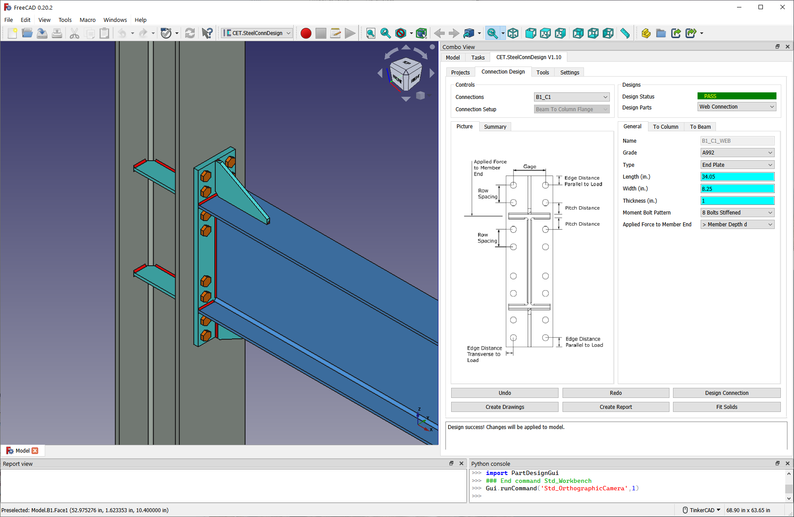

# General 
**CET.SteelConnDesign** is a **FREE**, cutting-edge steel connection design software that is built on the AISC 13th/14th/15th standards and powered by modern mathematical theories, offering users a powerful design solution. The software can run in 3 modes: standalone, integration with **[FreeCAD](https://www.freecad.org/)** or integration with **[Tekla](https://www.tekla.com/products/tekla-structures)**. CET.SteelConnDesign will also support Revit and Blender later.

The current version of **CET.SteelConnDesign** is designed exclusively for Windows OS and supports only Imperial units. While the program is not open-source, we are happy to share the source code with our partners upon request.  

Additionally, CET.SteelConnDesign supports plugins, providing users with powerful design tools and a platform to share ideas. As a step toward Open-Source development, we are starting with [Open-Source plugins](https://github.com/CivilEngrTools/SteelConnDesign_plugins) to foster collaboration and innovation within the community.

The goal of **CET.SteelConnDesign** is not to generate profit but to empower designers by leveraging modern software and saving them time. While it is available for free, we encourage users to explore the enhanced features of our Premium service. For more information on accessing Premium benefits, please contact **civilengrtools@gmail.com**. Premium users can enjoy the following advantages:

- Efficiently process thousands of members with just one click. Our software can
automatically identify Connection Setup types and design them with minimal user input
(under development).
- Utilize APIs to customize connection checks or design all connections using specific bolt
diameters or plate thickness (under development).
- Open and save project files in plain JSON format.
- Receive hot patches within 5 business days.
- Access feature requests and enhancements.
- Benefit from 24x7 email/video support.
- Attend in-person training sessions.
- Receive 10 developer hours for each Premium user, which can be used for custom
connection development.

# Why Choose CET.SteelConnDesign
Followings make CET.SteelConnDesign different from others:

1 Free to use: The standard version of CET.SteelConnDesign lets you explore unlimited connection types, loads, and materials for education, research, or commercial use.

2 Expertly designed: Our members, equipped with advanced degrees such as Masters and PhDs, possess profound expertise in Civil Engineering, Mathematics, and Computer programming. Led by a visionary with over two decades of industry experience, our team's strength extends to robust quality assurance and sales support.

3 User-friendly efficiency: Unlike competitors, CET.SteelConnDesign minimizes user inputs, automatically designing the most efficient connections.

4 Enhanced inspection: Enjoy a 3D interactive model created with FreeCAD and Tekla, allowing you to inspect connections more effectively.

5 Simple and powerful: The software's Connection-Oriented and efficient UI system lets you concentrate on specifying connection designs. Unique input fields accurately display user input and design results.

6 Detailed reports: Receive comprehensive connection design reports with user-friendly Latex equations, unit calculations, and detailed information.

7 Automated 2D drawing generation: Our software now automatically generates connection drawings for users, complete with dimensions and annotations (with FreeCAD only).

# Support
If you have any questions, feel free to reach out to us at civilengrtools@gmail.com. Premium users have the option to connect with our support team through Skype or Microsoft Teams.

# Social Media
Youtube:
https://www.youtube.com/@civilengrtools6051

Facebook
https://www.facebook.com/people/CivilStructural-Engineering-Tools/100083589511709/

Linkedin 
https://www.linkedin.com/company/civilengrtools (need login)

Twitter
https://twitter.com/CivilEngrTools (need login)

Reddit
https://www.reddit.com/r/SteelConnDesign/

Website
https://civilengrtools.com/

# Join Us     
We are a team of skilled engineers located in multiple places around the world. However, we need your help to promote our sales. As a sales representative, you can earn a percentage of premium subscriptions for each sale. Please reach out to us at civilengrtools@gmail.com if you have any questions or requests.

# Investment Opportunities
We are an emerging startup with a promising future and are actively seeking investment opportunities. If you are interested in partnering with us, please do not hesitate to contact us.

# Verification Problems

This example is from AISC Design Example V15.0 II.A-17B. Please check the model file in [Github](https://github.com/CivilEngrTools/SteelConnDesign/blob/main/Verification_Problems/AISC15_II_A-17B.bpj). Currently, they are 3 [examples](https://github.com/CivilEngrTools/SteelConnDesign/tree/main/Verification_Problems). Results:

| Location         | Item                                              | AISC Design Example Results | CET.SteelConnDesign Results | Difference |
| ---------------- | ------------------------------------------------- | --------------------------- | --------------------------- | ---------- |
| **Beam Web**     | Shear Yielding                                    | 128 Kips                    | 127.8 Kips                  | 0.16 %     |
|                  | Tensile Yielding                                  | 440 Kips                    | 440.1 Kips                  | 0.02 %     |
|                  | Tensile Rupture                                   | 171 Kips                    | 171 Kips                    | 0.0 %      |
|                  | Block Shear U shape, Axial Force                  | 106 Kips                    | 109.6 Kips                  | 3.4 % (1)  |
|                  | Bolt Shear                                        | 74.5 Kips                   | 74.55 Kips                  | 0.07 %     |
| **Single Plate** | Shear Yielding                                    | 145 Kips                    | 145 Kips                    | 0.0 %      |
|                  | Shear Rupture                                     | 92.5 Kips                   | 92.6 Kips                   | 0.11 %     |
|                  | Flexural Yielding                                 | 316 Kips                    | 314.7 Kips                  | 0.41 %     |
|                  | Interaction of axial, flexural and shear yielding | 0.148                       | 0.148                       | 0.0 %      |
|                  | Tensile Yielding                                  | 217 Kips                    | 217.1 Kips                  | 0.05 %     |
|                  | Tensile Rupture                                   | 155 Kips                    | 155.4 Kips                  | 0.39 %     |
|                  | Flexural Rupture                                  | 316 Kips                    | 314.7 Kips                  | 0.41 %     |
|                  | Interaction of axial, flexural and shear rupture  | 0.42                        | 0.42                        | 0.0 %      |
|                  | Block Shear L shape, Shear Force                  | 118 Kips                    | 117.8 Kips                  | 0.17 %     |
|                  | Block Shear L shape, Axial Force                  | 161 Kips                    | 160.9 Kips                  | 0.06 %     |
|                  | Block Shear U shape, Axial Force                  | 168 Kips                    | 167.5 Kips                  | 0.30 %     |
|                  | Block Shear Interaction                           | 0.241                       | 0.242                       | 0.41 %     |

Note: 

1. In the calculation of beam web block shear (U-shape), the AISC Design Example uses abeam edge distance leh = 1.75 inches, whereas CET.SteelConnDesign uses 2 inches, resulting in a 3.4% difference. Based on the drawing, our results appear to be reasonable. 

2) Bearing and weld calculation details are not compared in this table.

# Version History

| Version   | Description                                                  |
| --------- | ------------------------------------------------------------ |
| **V1.10** | 1. Support **moment  beam splice** connections 2. Added bolt solids in FreeCAD for 3D models and 2D drawings. 3. Introduced color settings for members and connections in FreeCAD. 4. Introduced **[Open-Source plugin system](https://github.com/CivilEngrTools/SteelConnDesign_plugins)**. |
| **V1.9**  | 1. Support beam web **angle** connections and Tension/Compression axial forces |
| **V1.8**  | 1. Support beam **flange blocks** (FreeCAD Only), **extended single plate** and **stabilizer plate** connection |
| **V1.7**  | 1. Support **beam splice** connections   2. Fix UI bugs like not being able to change design codes |
| **V1.6**  | 1. Support beam to beam web connections                      |
| **V1.5**  | 1. Support automated **2D drawing** generation with FreeCAD  |
| **V1.4**  | 1. Support beam to column, **moment end plate** connection with FreeCAD and Tekla |
| **V1.3**  | 1. Support beam to column, **end plate** connection (Moment end plate will be supported later) |
| **V1.2**  | 1. Support **column transverse stiffener** in beam to column flange, moment connection |
| **V1.1**  | 1. Support beam to column flange, **moment plate** connection |
| **V1.0**  | First Release: Beam to column **single plate** connection    |

# Road Map
CET.SteelConnDesign is evolving gradually. In upcoming releases, we plan to introduce support for beam splice connections, column splice connections, brace connections and others. In the long term, our goals include:

- Expanded design codes support, especially for Eurocode
- Integration of seismic design
- Implementation of **AI** for connection design
- Import IFC models

# Legal Disclaimer:
When installing and using our software, users are assumed to agree with the terms outlined in the License Agreement. 

